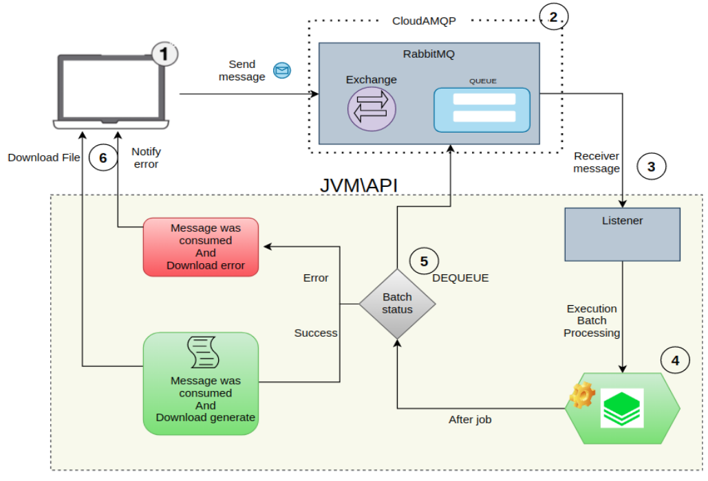

## Sistema de Mensageria e processamento Batch

#### Exemplo de sistema de mensageria integrado ao spring batch

* Neste projeto irei abordar um conceito de  mensageria integrado a uma arquitetura de downloads com arquivos csv. O intuito desse artigo é abordar uma breve introdução sobre mensageria e donwload com Spring Batch.

#### Arquitetura usada:

 

